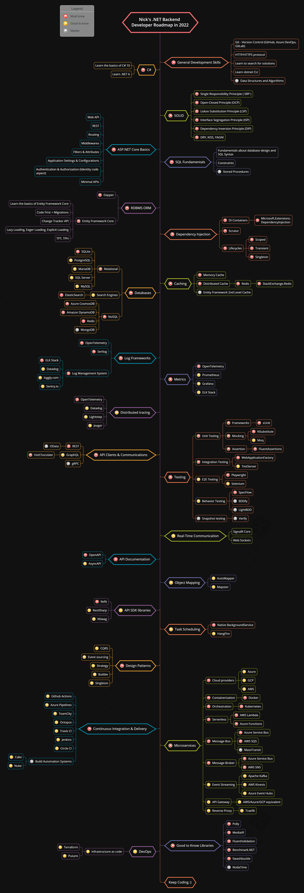

# Nick's .NET Backend Developer Roadmap for 2022

[Source here](https://github.com/Elfocrash/.NET-Backend-Developer-Roadmap)

This is a roadmap for .NET developers that want to focus on backend and specifically work with microservices. If you want a more generic ASP.NET Developer Roadmap, you can check the one that inspired this one [here](https://github.com/MoienTajik/AspNetCore-Developer-Roadmap).

In cases where I used cloud specific technology, like Azure Cosmos DB and AWS DynamoDB, you can assume that I also include the equivelent tech from other cloud providers like GCP.

